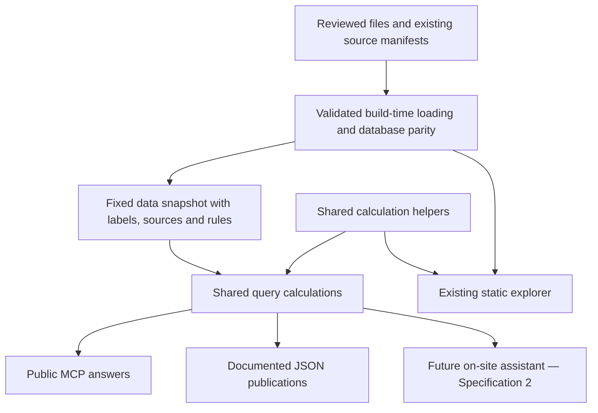

# Fiscal.ge v2 — Grounded Budget Query Service and External AI Access

**Document:** Specification 1 of the v2 programme
**Revision:** 3.0 — merges the revision 2.0 audit into the approved three-part delivery structure
**Date:** 2026-08-28
**Status:** Approved for planning. This document does not authorize implementation, paid services, publication, or deployment.
**Verified repository baseline:** `main` at `b9704ff0520cf5d231585da9eb294540c9a2bd7f`, including PR #88.
**Supersedes:** Revision 1.0 of this file (baseline `3a1d86876`, PR #87), whose defects are recorded in §2.4.

**Reading guide for the owner:** §1–§3 explain the release and what was verified. §5 explains the budget rules. §13 states the truth policy. §16 is the delivery plan. §4 and §6–§12 are the implementation contract and can be skipped on a first reading.

## 1. Purpose and product promise

Make Fiscal.ge a useful, verifiable source for Georgian public-budget questions, both for people using the website and for outside AI applications.

"Grounding" means an AI answer uses Fiscal.ge's reviewed figures, calculations, sources, and limitations instead of inventing a number or guessing how a spreadsheet should be interpreted.

This release provides:

- A shared calculator and rulebook, called the **query core**.
- A public **MCP connection**, through which compatible AI applications request information.
- An updated **`llms.txt` guide** and a **connection page**, so the service can be found and used.
- Complete, documented **JSON publications**, which software can read without scraping charts.
- Stable identifiers and reviewed Georgian names, with existing URL slugs exposed as matching aids.

The central promise:

> Every available figure has an unambiguous meaning, its data version, usable supporting sources, and the limitations needed to interpret it correctly. Unavailable figures are identified as unavailable, never replaced with invented values.

This is the first release of v2. It does not add the assistant that visitors will use on Fiscal.ge; that assistant is Specification 2.

Publishing a connection does not automatically make any AI application use Fiscal.ge. This release improves access and reliability; adoption must be demonstrated separately.

## 2. Scope and decisions

### 2.1 Included

1. A pure TypeScript query core under `apps/web/lib/factQuery/`.
2. Seven bounded functions: `describeCoverage`, `queryNational`, `queryMinistries`, `queryMunicipal`, `compare`, `rank`, `getSources`.
3. Shared calculation helpers used by the query core and the existing explorer where the same calculation exists.
4. Versioned input and output schemas, sources, citations, coverage information, and structured caveats.
5. A verified data snapshot packaged with each deployment; no database access while answering public queries.
6. One new application runtime route, `/mcp`.
7. Updated discovery guidance and JSON publications under the existing `/downloads/data/` family.
8. A public connection page explaining how to add Fiscal.ge to an AI assistant (§12.3).
9. English text for the caveat and error messages Fiscal.ge itself authors (§10.1). No dataset, entity, category or program is translated.
10. Endpoint abuse protection, operating limits, minimal query logging, and operating documentation.
11. A bilingual evaluation fixture, real-client compatibility checks, browser verification of citation links, and production verification requirements.
12. Small link and explanatory-copy updates on existing methodology and discovery surfaces. The production visual system is unchanged.

`compare` is deliberately added to the original six-function design. Changes and growth rates must be calculated by Fiscal.ge, with comparability checks, rather than left to an AI to improvise.

### 2.2 Not included

- The on-site assistant, its interface, `/api/ask`, conversation history, model selection UI, model-answer caching, or inference spending controls. These belong to Specification 2.
- A general REST query API, database query language, model-authored SQL, write access, accounts, uploads, or an administration interface.
- New financial figures, reclassification of reviewed spending, new extraction from official documents, or changes to existing financial amounts.
- Quarterly or monthly data; debt or capital-project explorers; the four future indicator datasets.
- Historical per-resident measures. The bounded 2025 total-budget measures already in the municipal index are the only per-resident measures exposed.
- A separate GDP or population data product. Supporting denominators are included only to reproduce approved budget measures.
- A redesign, new chart type, new interactive comparison screen, or new Excel-export options.
- Model training, embeddings, vector search, or a general document-search service.

Static JSON files are public data publications, not a new REST query service. MCP is a public programmatic interface and must be described honestly as such.

### 2.3 Owner decisions

Settled with the project owner on 2026-08-28.

1. **Truth policy.** Superseded during review — see §2.4 and §13. The owner's original decision permitted unsupported explanations without distinction; the owner reversed this after the audit. §13 is authoritative.
2. **Language.** Georgian-only data and labels. Only Fiscal.ge's own caveat and error text is also authored in English. Reversed on 2026-08-28 after verification showed the bilingual requirement was largely illusory and partly harmful (§10).
3. **External surfaces.** MCP connection, `llms.txt`, JSON publications, connection page. No public REST API.
4. **Access posture.** Open, free, unauthenticated, bounded by operating limits. Specification 2 owns inference spending controls.
5. **Query approach.** Typed bounded functions. No model-authored SQL, and no escape hatch until pilot evidence proves a need.
6. **No model lock-in.** No provider SDK in this release's production surface. Model selection is Specification 2 configuration, not code here.
7. **Delivery.** Three parts, engine first, each with an owner-verifiable gate (§16).

### 2.4 Defects corrected from revision 1.0

Revision 1.0 was written against a stale baseline and contained three defects that independent verification confirmed. Each changes required behavior.

| Revision 1.0 error | Verified reality | Consequence |
| --- | --- | --- |
| Caveat rule stated as "any returned row carries `show_warning`" | 45 municipal total rows have `show_warning=true`, but **46** carry a non-`none` `warning_type`. Municipality `11` (ხულო / Khulo), 2024, has `show_warning=false` with `warning_type=source_actual_missing` | The rule would have served Khulo's fallback figure **with no warning at all** — the single case most needing one. The engine must read quality state, not the display flag (§9.1) |
| Envelope specified `sources: [{ sourceId, name, url, lastReviewedAt }]` | **0 of 104** entries in `data/sources/source-documents.csv` have a URL; all `source_url_or_file` values are internal repository paths, and 32 are `+`-joined multi-file values | A single `url` per source is not implementable. Public links must resolve through `lib/methodology/workbookSources.ts` (which validates `retrieved_file_url` as https and yields `downloadHref`) and `lib/methodology/sourceManifest.ts` (§8.1) |
| Evidence table listed "527 budget, 286 expenditure" as separate served populations | 527 = 241 revenue + 286 expenditure. The separate files are the split of the same facts | Do not double-count the retained split files as additional served facts (§3) |

Further corrections adopted from the revision 2.0 audit:

| Revision 1.0 assumption | Revised decision |
| --- | --- |
| Shared loaders guarantee matching answers | Share calculation rules, identify the data version, and verify numerical agreement by test. |
| Build-time loaders can be used directly by `/mcp` | Build-time loaders read CSVs from disk and cannot serve a request-time function. Generate and package a fixed snapshot; public requests use that snapshot only (§4). |
| One numeric row shape fits every function | Share metadata, but use distinct catalogue, observation, comparison, ranking, source, and error results (§7). |
| Six functions are sufficient | Add `compare`. Growth and change are the most common budget questions and must not be left to model arithmetic (§6.6). |
| National revenue and expenditure share a budget concept | They do not. Subtracting the two published totals is not a deficit. `budgetScope` and the `budget_scopes_differ` caveat are required (§5.1, §9.2). |
| A new `/data/` publication family is necessary | Extend the existing `/downloads/data/` family and retain existing CSV URLs (§12.1). |
| No browser tests are needed | Verify citation links and any affected website behavior in a real browser (§14.4). |
| Public MCP logs are a prerequisite for designing Specification 2 | Use a controlled pilot with real users; logs are supplementary evidence (§17). |
| Bilingual catalogue coverage is a public-release requirement | Reversed. The site is Georgian-only and will remain so. Latin municipality names already exist as reviewed URL slugs, region and function IDs are already Latin or English, and translating the 48 program names would manufacture unreviewed English renderings of legally specific Georgian names (§10). |

## 3. Verified baseline and authoritative sources

Observations at the recorded commit, not hardcoded future limits. Production coverage must be derived from loaded data.

Rows marked **✓verified** were independently re-measured against the working tree during this revision.

| Area | Verified baseline | Consequence |
| --- | --- | --- |
| National budget file | 527 rows: 241 revenue and 286 expenditure; all `actual` **✓verified** | Do not count the retained split files again as additional served facts. |
| Administrative spending | 852 rows, including 48 distinct major-program series; all `actual` **✓verified** | Keep administrative categories and program children distinct. |
| Municipal functions | 7,040 rows for 64 municipalities, 2015–2025 **✓verified** | The served file already excludes codes `05`, `42`, `43`, `46`, `64`. |
| Municipal totals | 704 rows. 45 have `show_warning=true`; Khulo (code `11`) 2024 has `warning_type=source_actual_missing` with `show_warning=false`, value 30,969,077.43 GEL, measure `functional_total_fallback_missing_payment_actual` **✓verified** | The display flag is not the quality state. See §2.4 and §9.1. |
| Georgia municipal aggregate | 110 function rows and 11 total rows **✓verified** | Total rows already include the reviewed net Adjara adjustment. |
| Adjara adjustments | 11 annual rows **✓verified** | These explain additions and deductions; they are not another municipality. |
| Served municipal population | 64 rows for 2025, reference date 2025-01-01 | No historical or country-aggregate per-resident calculation is supported. |
| Served national GDP | 30 annual denominator rows, 1996–2025 | Only years needed by budget queries are used publicly. The 2025 denominator is preliminary. |
| Source registry | 104 logical entries; **0 have a URL**; all location fields are internal paths; 32 are `+`-joined multi-file values **✓verified** | Resolve public links through existing source manifests and the archive, never by treating the location field as a URL. |
| Public URL resolution exists | `lib/methodology/workbookSources.ts` validates `retrieved_file_url` as `https://` and produces `downloadHref` **✓verified** | Reuse it; do not invent a parallel resolver. |
| 2004 revenue | Ten served categories summing to exactly 2,283,035,800 GEL; **no `revenue.increase_liabilities` row exists** **✓verified** | The narrower-total limitation is real and must attach to totals, not to individual comparable tax categories. |
| National totals | Calculated by the explorer; no separate total rows in the budget file | The public catalogue must include valid calculated totals. |
| Taxonomy-only entries | Includes `revenue.taxes_total`, with no served fact rows | Do not advertise unsupported entries as queryable or sum taxonomy parents with their components. |
| Latin names already exist | `lib/explorer/municipalityRoutes.ts` carries 64 reviewed Latin slugs (`khulo`, `batumi`, `khelvachauri`) already live in production URLs. The 11 region IDs are Latin (`region.samtskhe_javakheti`); the 10 municipal function IDs are English words (`municipal.social_protection`) **✓verified** | No translation work and no schema change are needed for matching. Expose the existing slugs; invent nothing (§10.2). |
| Existing agent surfaces (PR #88, 2026-08-28) | `/llms.txt` is already published in llms.txt v2 order and guarded by `apps/web/tests/seo/agentFiles.test.ts`, which asserts **exact** equality of the link list against `requiredTargets`, that every HTML target also appears in the sitemap, and that the text matches `/no public API/i`. A branded 404 recovery page links to it. `/downloads/data/` holds three processed CSVs — `national-revenue.csv`, `national-expenditure.csv`, `municipal-expenditure.csv`; **there is no ministries CSV** **✓verified** | Extend these surfaces; never create a competing description. Publishing `/mcp` requires updating that test's `requiredTargets` **and** its "no public API" assertion in the same change, and any new HTML page linked from `llms.txt` must also enter the sitemap. |
| Pre-existing runtime decision gate | The merged agent-readiness design (`docs/superpowers/specs/2026-08-28-fiscal-agent-readiness-design.md`) defers Markdown content negotiation because it "would be Fiscal.ge's first request-time application layer", pending explicit owner acceptance of the runtime, latency, caching and cost boundary **✓verified** | `/mcp` crosses the same boundary that gate protects. This specification is where that boundary is accepted, and §11.4 defines the evidence required. Approving this document does not retroactively approve Markdown negotiation, which remains a separate owner decision. |
| Runtime | Existing application pages are prerendered | `/mcp` introduces the first application request-time function. |

Repository authority is unchanged: `Project_Definition.md` owns scope; `DESIGN.md` owns appearance and interaction; methodology documents own data meaning; `docs/deployment.md` owns release operations. This specification owns the bounded v2 decisions after approval.

Relevant existing code: `lib/data/servedData.ts`, `lib/data/activeFacts.ts`, `lib/explorer/explorerData.ts`, `lib/data/municipal/aggregateMunicipalFacts.ts`, `lib/explorer/municipalData.ts`, `lib/methodology/workbookSources.ts`, `lib/methodology/sourceManifest.ts`, `lib/explorer/urlState.ts`, `lib/servedRows.ts`.

## 4. Architecture and data versions

### 4.1 One verified publication per release



The snapshot builder uses the existing served-data loaders at build time. Build-only enrichment may read already-reviewed mapping, program-history, quality-control, and source-manifest metadata. It must not introduce new financial values or reinterpret original documents.

The query core accepts a snapshot as an input. It performs no filesystem reads, database queries, network requests, model calls, or logging of its own.

The server adapter loads a bundled snapshot once per process. The snapshot contains no credentials and no reference requiring the developer's filesystem. Keep the bundle behind a server-only module boundary; it must not enter the explorer's browser payload.

### 4.2 Reuse calculations without rebuilding the website

Reuse existing helpers for active actual/planned selection, shares, totals, and municipal aggregation. Where necessary, extract only the private arithmetic needed by both consumers into small modules with no browser, server, or provider dependencies.

Do not duplicate a formula in a second model. Do not import chart rendering, colour selection, or formatting into the query core merely to reuse arithmetic.

Existing reviewed amounts, Georgian presentation, default selections, and chart behavior remain unchanged. If an existing calculation conflicts with methodology, stop and report it for a separately reviewed correction; do not silently alter the website as part of this release.

### 4.3 Snapshot contents and identity

The snapshot contains active public facts, supporting denominators, taxonomy, program-history metadata, relevant quality states, public-source resolution, and the information needed to build the capability catalogue.

Every publication and successful core response identifies:

- `schemaVersion` — the external answer-format version, initially `1.0.0`.
- `dataVersion` — a SHA-256 over canonical snapshot content, including labels, source mappings, caveat definitions, and calculation-policy version.
- `releaseCommit` — the exact implementation commit.
- `generatedAt` — ISO UTC production time.

`generatedAt` and `releaseCommit` are not inputs to the content hash: an unchanged snapshot rebuilt later has the same `dataVersion`. Each downloadable file also carries its own byte count and SHA-256 in the manifest.

Any change affecting a published value or its interpretation must change `dataVersion`. A calculation change requires a corresponding calculation-policy version change, and agreement tests must cover the derived outputs. Do not reuse a data version for numerically different answers.

Preserve actual source review dates separately. A new build must not make old data appear newly reviewed.

All numeric operations within one request use one snapshot. An optional `expectedDataVersion` on every core function rejects a mismatched follow-up with `data_version_changed` rather than silently combining releases.

### 4.4 Deployment, cache and rollback behavior

Publish the explorer, MCP bundle, catalogue and JSON files from the same checkout and verified build inputs. Existing CSV publication must agree with corresponding snapshot values while preserving its established format and URLs.

MCP must continue answering from packaged data if the database becomes unavailable or changes after deployment. It must not refresh from the database during requests.

An invalid snapshot fails the build. A deployed endpoint with an unreadable or incompatible bundle returns a service error with no figures; it does not fall back to another data version or an external source.

Latest JSON URLs can change at the next release and must not receive permanent immutable-cache promises; their content identifies its version. Historical deployments and repository inputs support reproduction, but this release does not promise permanent public hosting of every previous JSON version. Citation links to the current explorer do not freeze historical screen state or data revisions.

## 5. Budget meaning and supported measures

### 5.1 Dataset boundaries

| Dataset ID | What the figures represent |
| --- | --- |
| `national-revenue` | Georgia's consolidated budget receipts, with documented internal-flow netting and financing categories. Not simply state-budget tax revenue. |
| `national-expenditure` | State-budget expenditure and payments classified into reviewed public spending fields. |
| `ministries` | State-budget administrative categories and reviewed major-program series. Programs are children of categories, not extra amounts to add to their parents. |
| `municipal-expenditure` | Reviewed municipal functional amounts and public totals, with separately defined region and Georgia aggregation rules. |

Revenue and expenditure use different budget concepts. **Subtracting these two published totals must not be presented as a budget deficit or surplus.** Likewise, adding state, municipal, regional and country aggregates is not a supported consolidation. The existing revenue methodology documents this boundary.

Every dataset and result carries a `budgetScope` identifier with a Georgian and English explanation. Dataset IDs, geographic IDs and category IDs are separate dimensions.

### 5.2 Measure matrix

| Query subject | `amount_gel` | `share_of_total_pct` | `share_of_gdp_pct` | `gel_per_resident` |
| --- | --- | --- | --- | --- |
| National revenue categories and total | Yes | Applicable consolidated receipts total | Same-year national nominal GDP | No |
| National spending fields and total | Yes | Applicable state expenditure total | Same-year national nominal GDP | No |
| Administrative categories and programs | Yes | Full administrative expenditure total, not selected rows or parent ministry | Same-year national nominal GDP | No |
| Municipality functions and total | Yes | That municipality's public total | No | Public total only, 2025 |
| Region functions and total | Yes | That region's public total, including the documented Adjara adjustment where applicable | No | Public total only, 2025 |
| Georgia municipal functions and total | Yes | The already-consolidated Georgia municipal public total | No | No |

Per-resident access exposes existing 2025 index calculations through the new service. It does not add historical population serving, per-resident chart controls, or Excel exports.

### 5.3 Arithmetic and missing values

- Monetary values use full GEL, not thousands or millions. Preserve reviewed precision and use the existing exact-money approach for addition and subtraction.
- Percentages use a 0–100 scale: `12.5` means 12.5%. Percentage differences use percentage points.
- Shares are not forcibly clamped to 0–100. Valid negative revenue corrections and documented functional-sum-versus-total differences must remain visible.
- Preserve genuine zero and negative values. Missing, excluded, invalid and zero are different states.
- Ratios require an available positive denominator; otherwise return null with a specific reason.
- When actual and planned versions exist for one fact, actual wins; never add them. Where a supported aggregate contains an active planned input, mark its basis planned and explain it. This does not expand actual-only input schemas to accept planned data.
- Selection does not change a percentage denominator. Selecting two categories does not make their sum the budget total.
- Totals follow the reviewed rule: an explicit applicable total takes precedence where supported; otherwise use approved non-overlapping components. Never add parent and child rows together.

### 5.4 Municipal consolidation

1. Individual public municipalities remain the existing 64 entities.
2. Regions use existing territorial membership. The Adjara regional headline adds republican actual payments and deducts republic-to-territorial transfers once.
3. The served Georgia total is already prepared from 69 municipal-budget series plus the same net Adjara adjustment. Use it directly; never apply the adjustment twice.
4. The five aggregate-only codes do not become public territorial observations or ranking candidates. Their codes may be explained in exclusion metadata; source documents may be cited without publishing separate amounts for those bodies.
5. The ten functional categories remain municipal-only. Do not allocate an invented republican residual or force shares to sum to 100%.
6. The 11 regional totals are not expected to sum to the Georgia total, because the five aggregate-only budgets have no territorial region assignment.

## 6. Catalogue and query functions

### 6.1 Common request rules

Use stable identifiers returned by the catalogue. Municipality codes remain strings with leading zeros. Unknown identifiers are never silently substituted with a similar name.

Observation requests require explicit `years` and a `measure`. Years are a non-empty integer array normalized to unique ascending order; ID arrays are deduplicated. Validate allowed combinations before calculating.

A year outside the dataset's overall coverage returns `year_out_of_range`; do not silently clamp. A valid series missing a year within coverage returns a missing cell with a reason. Excluded territorial entities return exclusion metadata and no numeric row.

Labels are Georgian; stable IDs and municipality slugs carry the Latin handles a client needs for matching. Caveat and error text is Georgian and English. The core does not interpret natural language or select an answer language; its client does that.

All seven functions accept optional `expectedDataVersion`.

### 6.2 `describeCoverage`

**Purpose:** explain what can be queried before asking for numbers.

Parameters: optional `datasetId`, `search`, `entityType`, `level`. With no dataset filter, return the four dataset summaries; with one, return its entity and series catalogue. `search` is a maximum 120-character filter over stable IDs, reviewed Georgian names, and municipality slugs; it does not change underlying coverage.

Return available years, exact years per series, supported measure combinations, entity types, category hierarchy, totals, exclusions, source and methodology links, and whether a result is a reviewed subset.

Distinguish: served observations; supported calculated totals including `revenue.total`, `expenditure.total`, `admin_spending.total`, `municipal.total` where applicable; and taxonomy-only entries with no supported public value.

Do not present `revenue.taxes_total` as queryable. Do not omit valid calculated totals merely because the CSV has no total row.

Program coverage is per series. Nine current program series have approved historical joined points before 2012; other programs do not inherit those years. The 48-program catalogue is not a list of every government program.

### 6.3 `queryNational`

Parameters: `side` (`revenue` | `expenditure`), `seriesIds`, `years`, and a measure allowed by §5.

Return category and total observations for `country.georgia` with the correct dataset and budget scope. Geography alone must not imply identical budget coverage on the two sides.

For 2004, unavailable liabilities remain missing. A total-dependent 2004 query carries the narrower-total limitation. Do not attach that comparability warning indiscriminately to an otherwise comparable individual tax amount.

### 6.4 `queryMinistries`

Parameters: `level` (`admin_category` | `major_program`), `seriesIds`, `years`, and an allowed measure. The administrative total is available with `admin_category`; it is not a program.

Use existing approved program identities, semantic-era separation and historical joins. Never join two programs because their names resemble each other.

Return parent identifiers, level, current reviewed Georgian series names, original historical labels where relevant, exact available years, and required history and coverage notes. Program amounts do not add to their parent as additional spending.

### 6.5 `queryMunicipal`

Parameters: `entityIds`, `seriesIds`, `years`, and an allowed measure.

Entities may be municipalities, regions, or `country.georgia`. Every row identifies both entity and series. Different entity types may be returned for inspection, but the service does not sum overlapping geography.

Apply §5.4 exactly. Preserve the actual public-total definition, including the 2015 fallback and Khulo 2024. A reviewed fallback amount can be available while its intended payment-total component is unavailable.

### 6.6 `compare`

**Purpose:** calculate change without asking the AI to do the arithmetic.

Parameters: one `target`, `fromYear`, `toYear`, `measure`, with `fromYear < toYear`. `target` is one of the three observation selectors above, without `years` or `measure`. It may select several entities or series, but every comparison is the same entity and series across two years within one dataset.

For each selected entity and series, return both endpoint observations plus:

- For `amount_gel`: change in GEL and percentage change.
- For percentage measures: change in percentage points, not percentage growth of a percentage.
- Comparability: `comparable`, `limited`, or `not_comparable`, with reasons.

Percentage change is `(later − earlier) / earlier × 100`. A zero or negative starting amount makes percentage change unavailable but does not prevent a valid absolute GEL difference.

Do not calculate comparable growth when endpoints use incompatible total definitions, different actual/planned bases, or lack required values. Return endpoints and null change fields with the reason. In particular, a 2004-to-later receipts-total comparison and a 2015-to-payment-total municipal comparison are not like-for-like growth. The same rule applies to shares depending on those changing totals.

Check the definitions of contributing inputs, not just an aggregate's final name. Two rows both called a consolidated total can contain different underlying definitions. Where an approved program-history join documents a coverage change, use that evidence to qualify or decline; a stable ID alone does not prove unchanged coverage.

**Comparability is decided by `valueDefinitionId`, never by `valueDefinition`.** The prose field is written for a reader and is wrong for this purpose in both directions: it is constant across the municipal 2015 portal-fallback break, and it varies when a ministries program is merely renamed. Implementing this clause against the display string published a 64-row league table of municipal education "growth" across that break, and separately emptied whole program rankings over cosmetic label changes. `valueDefinitionId` carries only what changes the measurement.

**Every caveat rule declares a `comparisonEffect`** of `breaks`, `limits`, or `none`, and `compare` derives its decision from that. This replaced a hand-maintained list inside `compare` which nothing could prove complete — and which was not: `revenue_internal_flows_netted` marks the year a revenue series begins subtracting internal flows, and `revenue.grants` 2005-to-2020 was published as `comparable, +651.19%`. Coverage changes decline a comparison; quality and provenance flags do not. The catalogue in `docs/data-methodology/ai-grounding-and-caveats.md` records the effect for all 24 codes.

A documented GDP accounting-standard change can produce a `limited` percentage-point comparison with its caveat. Nominal GEL growth is allowed but never described as inflation-adjusted growth.

Cross-dataset deficit calculations, totals across overlapping geography, unsupported per-resident periods, and comparisons between unrelated series are outside this function.

### 6.7 `rank`

Parameters: `datasetId`; `dimension` (`series` for national/administrative, `entities` for municipal); `level` for ministries with optional `parentSeriesId` when ranking programs within a category; `entityType` (`municipality` | `region`) and one `seriesId` for municipal rankings with optional `withinRegionId`; `period` as one `year` or `fromYear`/`toYear`; `measure`; `metric` (`value` | `absolute_change` | `percentage_change` | `percentage_point_change`); `order` (default `descending`); `limit` (default 10, maximum 100).

`value` requires one year. Change metrics require two years and reuse `compare`. Absolute and percentage change operate on GEL amounts; percentage-point change operates on percentage measures. Unsupported combinations are rejected.

Rank only peers: municipalities against municipalities, regions against regions, administrative categories against categories, programs against programs. Totals, parent rows and the Georgia aggregate do not compete with their components.

Value rankings require a consistent actual/planned basis. If eligible active rows mix bases, return `unsupported_comparison` with an explanation rather than one unqualified ordering. An entirely planned ranking stays visibly marked as planned.

For change rankings, omit candidates that are not comparable or whose metric is unavailable, and report their count and reasons. A `limited` comparison may remain only with its visible caveat.

Order full-precision values before formatting. Equal values are ordered by stable ID; return sequential `position` and an explicit `tied` flag so an arbitrary tie-break is not presented as a meaningful difference. Report any cutoff through a tied group.

Return the ranking universe, eligible count, returned count, exclusions, and the ranking definition. A program ranking is explicitly among reviewed served program series, not every programme in government.

### 6.8 `getSources`

Parameters: `sourceIds`, with optional `datasetId`, `years`, `entityIds` to narrow a grouped source to relevant originals.

Return resolved logical sources, their specific public documents, review dates, official and archive URLs, hashes, rights information, and methodology links. Unknown sources produce a structured error with bounded suggestions, never an invented URL.

## 7. Response contract

### 7.1 Common structure, different result types

One Zod schema module owns both input and output schemas, and is the single source from which MCP JSON Schema and any later AI SDK tool definitions are derived.

Every core response has `kind`, `status`, `data` or `error`, and `meta`.

| Field | Contract |
| --- | --- |
| `kind` | `catalogue`, `observations`, `comparisons`, `ranking`, `sources`, or `error`. |
| `status` | `ok`, `partial`, `empty`, or `error`. A missing or excluded result must not masquerade as complete. |
| `meta` | Schema and data versions, release commit, generation time, publisher and licence, resolved sources and documents, caveats, and citations relevant to this response. |
| Normalized request | Only validated dimensions and selections, so the answer states which question was actually calculated. |

Transport failures before a tool executes follow MCP and HTTP error rules; they are not fabricated successful core responses. Source arrays may legitimately be empty for invalid requests or catalogue results with no numerical observations.

`ok` means all requested result units are available; `partial` means some are unavailable or excluded; `empty` means none is available. An empty comparison result may still carry endpoint observations and explanations but no usable change. Caveats alone do not make an otherwise complete observation result partial. Structural or unsupported-request failures use `error`.

### 7.2 Observation fields

| Field | Meaning |
| --- | --- |
| `observationId` | Stable identity within this data version, built from dataset, entity, series, year and measure. |
| `datasetId`, `budgetScope` | Which budget dataset and accounting boundary the figure belongs to. |
| `entityId`, `entityType`, `entityLabelKa`, `entitySlug` | The geography, kept separate from the category. `entitySlug` is present for municipalities only, is the existing URL slug, and is never presented as a translation or official name. |
| `seriesId`, `seriesLabelKa`, `level`, `parentSeriesId` | The category, program or total and its hierarchy. The stable ID carries the Latin handle; there is no English label field. |
| `year`, `measure`, `unit` | Observation year and explicit numeric meaning. Units are `GEL`, `percent`, `GEL_per_resident`. |
| `value` | A finite number when available, otherwise `null`. |
| `availability`, `missingReason` | `available` or `missing`, with an explanation when missing. Excluded entities have no observation row. |
| `basis` | `actual`, `planned`, or `null` when no figure is available. |
| `valueDefinition` | The actual definition, including public-total fallback or consolidated-total status. Human-readable prose; never used to decide comparability. |
| `valueDefinitionId` | Structured identity of what is measured, for machine comparison. Two observations with the same id measure the same quantity the same way; a difference is a real definition break. Excludes anything cosmetic, notably a series' year-specific official label. |
| `sourceIds`, `documentIds` | All relevant logical sources and the exact public originals supporting the result. |
| `calculation` | Direct observation or named calculation, contributing observation references, numerator and denominator where applicable, and the calculation-policy version. |
| `caveatIds`, `citationIds` | Links to applicable records in response metadata. |

Supporting inputs that are not independently queryable budget observations, such as population or GDP, receive named references with value, year or reference date, and sources. This does not advertise them as standalone datasets.

### 7.3 Coverage and completeness

Report requested years, available years, returned years, missing entity/series/year cells, excluded entities with reasons, and returned versus expected counts. Give coverage per series or entity where it differs; a single first and last year pair is insufficient.

Never shorten a requested range silently. Never return the first part of an oversized answer as though complete. Return `result_too_large` with instructions to narrow the request or use the published dataset.

### 7.4 Error contract

Errors include a stable code, short Georgian and English messages, a retryable flag, and bounded valid choices or recovery guidance where appropriate.

Required codes: `invalid_parameters`, `unknown_dataset`, `unknown_series`, `unknown_entity`, `unknown_source`, `year_out_of_range`, `unsupported_measure`, `unsupported_comparison`, `result_too_large`, `data_version_changed`, `rate_limited`, `service_unavailable`.

Bad identifiers are errors. Known aggregate-only entities are exclusions. Missing cells within legitimate coverage are missing observations. These are different outcomes and must be tested separately.

Never return stack traces, credentials, internal paths, raw query bodies, or instructions copied from untrusted input.

## 8. Sources, calculation evidence, citations and licence

### 8.1 Public source resolution

Preserve existing logical source IDs. Resolve them through the existing reviewed source manifests and public archive, using dataset, year, entity and source role where necessary. Reuse `lib/methodology/workbookSources.ts` and `lib/methodology/sourceManifest.ts`; add explicit reviewed mappings only for unresolved cases.

This is required, not optional: no entry in `data/sources/source-documents.csv` carries a URL, and 32 entries name multiple files. A naive `source.url` field is not implementable.

Each public document record identifies its archive ID, original title, publisher, official URL where recorded, Fiscal.ge archive URL, byte hash, retrieval and review dates where available, and recorded rights status.

Do not invent missing dates, original URLs, or page and cell references. Where an exact locator exists in reviewed metadata, retain it. Original document titles may remain in their original language; translating the government archive is not part of bilingual catalogue completion.

**The build fails if an available figure lacks a resolvable supporting public source.** No sentinel such as `mixed:source_id` may be emitted as a registered source. For grouped figures, retain constituent source IDs before aggregation replaces or clears them.

### 8.2 Derived figures

A derived figure includes all contributing sources, not merely the numerator's. This applies to totals, growth, GDP shares, per-resident figures, regional aggregates, and the Adjara adjustment.

Explain Fiscal.ge calculations as calculations. A source document supporting inputs is not automatically a document publishing the final derived number.

For the country municipal aggregate, complete source attribution must not turn the five aggregate-only bodies into separate public territorial rows or expose individual contribution amounts.

### 8.3 Verification links

Use existing URL-state serializers and municipality route mappings to build explorer links, preserving requested year or range, grouping, series, and supported measure.

A query covering several municipalities may return several links. There is no requirement to manufacture one URL reproducing a view the website does not have.

Each link declares `exact_view` or `supporting_view`. Unsupported view combinations, per-resident rankings the current UI does not show, and API-only calculations must not be advertised as exact screen reproductions. Supply relevant source and publication links as well.

Citation text identifies Fiscal.ge, dataset and budget scope, period, data version, and the source or calculation. Explain that an explorer link opens the current publication while the response records the version used for the answer.

### 8.4 Licence

Fiscal.ge's processed data is published under CC BY 4.0, with its full licence URL and attribution text in responses and artifacts. Keep the rights of original government documents separate, as the site already does. Do not claim ownership of public-domain facts or impose restrictions inconsistent with the licence.

Outside clients receive citation instructions, but Fiscal.ge cannot guarantee that every client will display or preserve them.

## 9. Caveat engine

### 9.1 Inputs and behavior

The caveat engine receives the normalized request, original relevant quality states, all contributing inputs, value definitions, and calculation or comparison context.

**It must not depend only on final displayed rows or on `showWarning`.** Revision 1.0 made exactly that error: Khulo 2024 carries `source_actual_missing` with `show_warning=false`, so a display-flag rule would have served a fallback figure with no warning.

Each caveat contains a stable `code`, `severity` (`severe` | `note`), Georgian and English messages, methodology references, and exact affected observation, entity, series and year references. `severe` means the limitation materially changes interpretation; it does not automatically mean the reviewed number is wrong.

Rules and bilingual messages have one versioned owner. The new caveat-catalogue methodology document cross-references existing methodology for every rule. Tests check both required firing and inappropriate firing. A code appearing in a document is not proof its trigger is correct.

### 9.2 Required catalogue

| Code | Trigger and required meaning | Severity |
| --- | --- | --- |
| `nominal_gel` | Multi-year GEL observations or changes: current prices, not inflation-adjusted. Single-year price basis still appears in metadata. | note |
| `planned_values` | Any returned active planned amount or aggregate containing a planned input; identify affected values. | severe |
| `revenue_2004_total_scope` | A 2004 receipts total, or a measure using it as denominator: narrower coverage, liabilities unavailable. | severe |
| `revenue_2004_liabilities_unavailable` | Requested 2004 liabilities: unavailable, not zero. | severe |
| `budget_scopes_differ` | A requested national revenue or expenditure total: these two totals have different budget concepts and cannot establish a deficit by subtraction. Dataset scope descriptions always explain the restriction; the core does not infer natural-language intent. | severe |
| `negative_revenue_correction` | A returned negative revenue observation: preserve the reviewed correction; do not call it missing or invalid. | note |
| `revenue_internal_flows_netted` | A selected grants or other-revenue value uses documented internal-flow netting; describe the adjustment. | note |
| `gdp_sna_break_2010` | GDP-based results span both pre-2010 and 2010-onward denominator standards. Do not fire for a single 2010 observation alone. | note |
| `gdp_preliminary` | A denominator used by the result is marked preliminary, including current 2025 GDP. | note |
| `municipality_not_territorial` | A query explicitly names `05`, `42`, `43`, `46`, or `64`: explain the exclusion; return no territorial amount. | severe |
| `municipal_country_scope` | Georgia municipal aggregate: 69 reviewed budgets plus the documented net republican adjustment; regional rows do not sum to this total. | note |
| `adjara_consolidation_applied` | A returned total or denominator actually uses the net Adjara adjustment. Do not claim a functional-category numerator was adjusted. | note |
| `municipal_functions_no_republican_crosswalk` | An Adjara or Georgia functional amount or share: republican functional allocations are neither included nor invented. Do not attach to unrelated ordinary municipalities. | note |
| `municipal_total_definition_changed` | Comparison endpoints use different public-total definitions, including the 2015 fallback: no like-for-like growth result. | severe |
| `municipal_source_actual_missing` | The relevant total or its input has `source_actual_missing`, **regardless of the warning flag**. Khulo 2024 uses the reviewed functional actual instead of an unavailable payment actual. | severe |
| `municipal_source_version_difference` | Relevant functional and total inputs come from documented differing source versions; do not force reconciliation. | severe |
| `municipal_financing_outside_functional` | Relevant public total includes financing components not distributed across the ten functions. | note |
| `municipal_functional_total_gap` | A requested functional share or decomposition does not cover the applicable public total; never normalize to an invented 100%. | note |
| `per_resident_coverage_limited` | Unsupported per-resident year, category or country request: only approved 2025 municipal and region totals are supported. Returned with the appropriate error, not an invented ratio. | severe |
| `program_coverage_partial` | Requested program observations have missing years, or the comparison or ranking uses a reviewed subset; distinguish missing from zero and explain the eligible population. | severe |
| `admin_category_not_yet_established` | An administrative CATEGORY has no row for a requested year because it was established later (regional development and infrastructure starts in 2009). Split out of `program_coverage_partial` during implementation, which had claimed a program gap on category cells in both languages. | severe |
| `program_historical_join` | A returned observation uses an approved historical organizational line or succession join; preserve its scope and original label. | note |
| `program_parent_category_modern_grouping` | A program cell whose parent category had no row in that year: the parent is the series' modern grouping, not a containment claim. Three cells (roads, 2006-2008). The amount and share stay correct and unchanged. | severe |
| `non_positive_comparison_base` | Percentage growth would divide by a zero or negative starting amount; percentage growth is null while a valid GEL difference may remain. | note |

The engine preserves relevant limitations through regional and country calculations even where display-oriented aggregation clears reconciliation flags. A genuinely unresolved material reconciliation error blocks publication; a caveat is not a substitute for required validation.

Methodology owners: revenue rules in `revenue-methodology.md`; GDP rules in `national-nominal-gdp.md`; municipal totals and consolidation in `municipal-functional-annual-2015-2025.md`; population in `municipal-population-regional-gdp.md`; program history and selection in `ministries-drilldown-programs-methodology.md`.

## 10. Language

Fiscal.ge is a Georgian product and this release does not change that. The website stays Georgian-only. **No dataset, entity, category, or program is translated into English.**

This reverses the bilingual requirement carried by earlier revisions. Verification showed that requirement was largely illusory and partly harmful:

- The 64 Latin municipality names **already exist** as reviewed URL slugs in `lib/explorer/municipalityRoutes.ts` — `khulo`, `batumi`, `khelvachauri` — live in production URLs and therefore already reviewed and stable.
- The 11 region IDs are already Latin transliterations: `region.samtskhe_javakheti`, `region.kvemo_kartli`.
- The 10 municipal function IDs are already English words: `municipal.social_protection`, `municipal.education`.
- The 48 major-program names are the only genuinely untranslated set, and translating them would manufacture unreviewed English renderings of legally specific Georgian program names — a new class of citable error the platform does not currently have.

The consumer of this service is a language model, which translates competently. A response carrying `seriesId: "municipal.education"` with `labelKa` set to the Georgian name gives a client everything it needs to answer in any language. Pre-translating for a translator adds permanent maintenance burden and new risk without adding capability.

### 10.1 What is authored in English

Only text Fiscal.ge itself writes as a warning or a refusal:

- the caveat messages (§9.2);
- the error messages (§7.4).

These are the sentences where precise wording matters most and where a model's improvised translation is least acceptable — a mistranslated limitation is worse than a mistranslated label. They live in the caveat catalogue and error definitions as plain source files: no database field, no migration, no parity check.

### 10.2 Matching aids, not translations

`describeCoverage` exposes each municipality's existing URL slug as `entitySlug`, and `search` matches over stable IDs, Georgian names, and slugs. An English question about "Khulo" therefore resolves to code `11` without inventing an official English name.

`entitySlug` is documented as a URL slug, never as a translation or an official name. No other entity type gains one.

### 10.3 No pipeline change

This release adds no English field to any taxonomy file, TypeScript type, or Prisma model, and creates no program-label registry. `MunicipalFunctionCategory`, `MunicipalRegion` and `Municipality` are untouched. There is no migration, no import-mapper change, and no parity canonicalisation change.

Making Fiscal.ge bilingual would be its own specification, driven by the website, not by this service.

## 11. MCP endpoint and operations

### 11.1 Connection design

Implement `/mcp` as a Node.js Vercel Function in the existing Next.js application. It handles transport, schema conversion, limits and logging, then calls the pure query core. It offers read-only tools; no writes, arbitrary URLs, filesystem paths, SQL, or model sampling.

Use a released MCP SDK and lock its version. Initial required protocol compatibility is Streamable HTTP `2025-11-25`, stateless, with no application session store. The inspected stable TypeScript SDK v1.29.0 advertises that protocol; do not advertise a newer revision merely because newer documentation exists. Supporting a newer revision requires its own tested SDK and client compatibility evidence.

Support protocol initialization, tool discovery and tool calls for the declared revision. GET and DELETE behavior must match the selected stateless transport; an ordinary browser GET returning 405 is not itself a failure. Do not expose the older separate `/sse` transport or long-lived background subscriptions.

MCP input and output schemas come from the shared Zod module. Return the validated envelope as structured tool content plus an equivalent text representation for clients that consume text. Mark tool errors as errors. Tool annotations identify read-only, non-destructive behavior.

Server instructions explain scope, units, missingness, required caveats, citation behavior, and the prohibition on unsupported causal or fiscal-balance claims. They cannot replace correct structured data.

### 11.2 Security

Validate request origin and host against the deployment's known configuration. Reject malformed, opaque or unapproved present origins; permit origin-less server clients when otherwise valid. Configure browser access only for explicitly supported origins, with no wildcard credentialed access. Reject spoofed host forwarding and obtain limiter addresses only from trusted platform request metadata. Origin checks are protocol security controls, not proof of caller identity.

Public unauthenticated access is intentional because every tool reads approved public data. No database credentials are needed by request-time code. Reviewed source text is data, never instructions to execute. Errors and logs must not expose environment variables or internal paths.

### 11.3 Initial operating defaults

Proposed launch settings, not changes already made to the hosting account.

| Control | Initial requirement |
| --- | --- |
| Incoming body | Maximum 32 KiB; reject before full processing. |
| Returned observation cells | Maximum 500 per tool call; explicit error above that. |
| Comparison candidates | Maximum 250 endpoint pairs per call. |
| Ranking output | Default 10, maximum 100. |
| Serialized tool result | Maximum 512 KiB including evidence and both representations; never silently trim sources or warnings. |
| Input arrays | At most 100 entities, 200 series, 100 years, 100 source IDs, further restricted by coverage and result limits. |
| Per-network request rate | 60 MCP HTTP requests in a rolling minute, including failed attempts. |
| Global daily accepted requests | 10,000 per UTC day across all function instances. |
| Request duration | Maximum 10 seconds; cancel abandoned work where supported. |
| Pause control | A documented switch that disables `/mcp` without disabling static pages or downloads. |

**Correction, measured during Part 3 implementation.** The observation-cell and serialized-size rows above cannot both hold for municipal data. A compliant 495-cell request (45 municipalities x `municipal.total` x 11 years) serializes to 517.0 KiB, at roughly 936 bytes of JSON per municipal observation; before the `meta.sources` narrowing that same request was 541.9 KiB. A request can therefore satisfy the 500-cell cap and still produce a response the 512 KiB ceiling must refuse.

The **byte ceiling is the binding gate**. The cell cap stays as a cheap pre-check that avoids serializing an obviously oversized result. An over-ceiling result is refused whole with narrowing guidance and a link to the bulk files, never trimmed: sources and warnings are not dropped to make a result fit.

The "equivalent text representation" is a compact table, not a second serialization of the envelope. Equivalent means equivalent in content, not in structure, and both representations are counted against the one ceiling. Measured, the text twin costs about 34% of the JSON it accompanies rather than doubling it.

Enforce shared quotas with platform controls or a minimal approved shared counter, not process-local memory. A counter failure stops expensive MCP processing with a retryable service error. Do not quietly disable limits.

Reject over-limit requests with the appropriate status and retry guidance. Fixed single-POST requests are supported; reject oversized or unsupported protocol batches before processing.

A provider's shared network address may represent many users. The IP-based control is an abuse limit, not a per-person quota. Verify behavior with the chosen clients and adjust only after recording load and cost evidence.

An oversized numerical query receives narrowing guidance and links to bulk data. Metadata queries receive dataset and source filters and publication links rather than truncated catalogues.

### 11.4 Cost and performance

There are no production model-inference calls in this specification. Hosting, bandwidth, logging and any shared limiter can still incur usage. Application quotas do not cap every possible charge from an internet traffic flood.

Before enabling public MCP, record the actual hosting plan, limiter availability, applicable unit costs and allowances, measured resource use, expected traffic, budget alerts, and an owner-approved operating budget. Implementation approval does not authorize a plan upgrade, a paid database or counter, or unlimited overages.

Use the snapshot to avoid request-time database and parity work. Under documented representative load, target warm-response p95 below 1 second and first cold response below 5 seconds, excluding the outside model's own answer time. Record test region, concurrency and payload sizes; failure requires investigation before public enablement.

### 11.5 Logs and privacy

Application logs may contain timestamp, tool name, validated stable IDs, years and measures, data version, result count, response size, duration, outcome, and error code. Retain detailed application events for 14 days and aggregated service metrics for 90 days.

Do not retain raw prompts, invalid parameter strings, request bodies, authorization headers, full user agents, or IP addresses in application analytics. Limiter identifiers must be short-lived, expiring no later than their enforcement window plus operational grace. Hashing an address does not justify calling persistent records anonymous.

Document actual hosting and security-provider access-log retention separately. Do not promise that no provider ever processes an address. Logs describe tool activity, not necessarily unique people, original questions, or successful final AI answers.

## 12. Static guidance, downloads and discovery

### 12.1 Publication paths

Keep existing CSV URLs and raw methodology archive behavior. Publish generated files under `apps/web/public/downloads/data/`:

| Public path | Contents |
| --- | --- |
| `/downloads/data/manifest.json` | Version, dataset inventory, URLs, row counts, coverage, content hashes, byte sizes, licence, generation time. |
| `/downloads/data/catalogue.json` | Complete reviewed capabilities, entities, series, calculated totals, hierarchy, exclusions. |
| `/downloads/data/sources.json` | Complete public source and document resolution for this release. |
| `/downloads/data/national-revenue.json` | All active revenue observations and applicable calculated totals. |
| `/downloads/data/national-expenditure.json` | All active public-field expenditure observations and calculated totals. |
| `/downloads/data/ministries.json` | Administrative and program observations, separated by hierarchy, plus the applicable total. |
| `/downloads/data/municipal-expenditure.json` | Municipal, regional and Georgia observations, separated by geographic level and scope. |

Each dataset JSON is self-contained for its content: base GEL observations, relevant catalogue entries, exact missing and partial coverage, source and document definitions, applicable caveats, calculation rules, licence. Include only the supporting GDP and population values needed to reproduce its allowed ratios. Precomputing every possible ranking or comparison is not required.

All files use the same observation and metadata definitions as the query core. The bulk generator uses an internal build interface over the full approved snapshot; public request quotas do not truncate build outputs.

Note that `ministries.json` has no existing CSV counterpart in this family; it is a new published dataset, not a format conversion of something already served there.

These datasets include overlapping totals and components for inspection. Every row's role, parentage and geographic level must be explicit, and the file must warn that summing all rows is invalid. Source references and caveat definitions must remain usable if the file is downloaded without reading `llms.txt`.

### 12.2 Existing pages and `llms.txt`

Update the existing `/llms.txt`, retaining its concise guide format: when to use Fiscal.ge, current coverage, budget-scope distinctions, the most serious interpretation restrictions, licence and attribution, the tested MCP connection, and links to manifest, catalogue, sources and methodology.

Generate changing coverage and identifiers from the same catalogue; do not maintain a second handwritten inventory. Full taxonomies belong behind links, not in an oversized root guide.

Update the blanket "no public API" wording to describe the read-only MCP connection and static publications while preserving exclusions for REST queries, writes, and unavailable datasets.

`apps/web/tests/seo/agentFiles.test.ts` currently asserts that `/llms.txt` matches `/no public API/i`, compares its link list for **exact** equality against `requiredTargets`, and requires every linked HTML target to appear in the sitemap. Every one of those three assertions must be updated in the same change that publishes `/mcp`: the wording assertion because the claim becomes false, `requiredTargets` because manifest, catalogue, sources and connection-page links are added, and the sitemap because the connection page is HTML. Leaving any of them unchanged either fails CI or publishes a false statement about the service.

Add small JSON-publication links beside existing processed-data links on methodology pages, linking both expenditure and ministries JSON from the expenditure methodology. Keep the existing design and source archive intact. Where existing `Dataset` structured data describes downloads, keep it aligned with the actual published formats; no separate SEO redesign is included.

Serve UTF-8 text and JSON with correct content types. New processed-data files must not inherit the raw-originals `noindex` rule. Existing raw archive restrictions, CSV encodings and Excel downloads remain unchanged.

Discoverability means files can be found and accessed. It is not a promise that search engines or AI products will index, select, or cite them.

### 12.3 The connection page

An MCP endpoint with no discovery path is a feature nobody uses. Every other surface in §12 is machine-facing; this is the one human-facing page, and it is the entire funnel.

A Georgian-first page carrying: what the service does in plain language for a non-technical journalist; the endpoint URL with a copy control; per-application connection steps; example questions; and an explicit coverage statement naming both what is served (2004–2025 national, 2015–2025 municipal) and what is not (quarterly, monthly, debt, capital projects). The coverage statement prevents a user asking for out-of-scope data and concluding the tool is broken.

Follows `DESIGN.md` v4.1. No new visual direction, chart type, or interaction pattern is introduced.

## 13. Truth policy and the future assistant

The owner's original decision permitted the future assistant to state unsupported explanations without distinction. **The owner reversed this decision on 2026-08-28 after reviewing the audit.** The following is authoritative and supersedes item 1 of revision 1.0's decision list:

> Fiscal.ge's assistant may explain verified figures and offer clearly identified interpretations. It must not present unsupported causes, outcomes, assumptions or predictions as established facts. It must say when the available data cannot answer a question.

A continuous, natural answer is allowed. A separate interpretation panel is not required. Numbers need inline references, and serious limitations must appear close to the claims they qualify.

An increase in spending does not by itself prove improved services, efficiency, corruption, policy success, or its cause. A citation to a budget figure does not support such an explanation unless additional appropriate evidence is supplied under an explicitly approved future scope.

The query core and this production MCP route contain no model SDK or inference code. Input and output schemas remain usable by a later AI SDK adapter without redefinition. Do not add unused model-provider dependencies to this release merely to demonstrate portability.

Specification 2 may use AI SDK configuration to select supported providers, but a model change still requires compatibility, numerical, citation, caveat, language, latency and cost evaluation. A common provider interface does not guarantee equal behavior.

## 14. Verification and acceptance

### 14.1 Deterministic tests

Extend existing tests where practical; add focused query-core tests for behavior with no natural existing home. Required coverage:

- Every input and output variant, invalid parameters, and recovery response.
- Multi-entity, multi-category, multi-year result identity.
- Actual-over-planned precedence, derived totals, and prevention of parent/child double-counting.
- Real zero, legal negative revenue corrections, missing cells, non-positive comparison bases.
- Percentage scaling, denominators, rounding, and the allowed-measure matrix.
- Per-series program coverage and approved historical joins.
- Territorial exclusions in queries, rankings and bulk publications.
- Adjara regional adjustment applied exactly once, and the already-adjusted Georgia total without a second addition.
- Khulo 2024, the 2015 fallback, preliminary GDP, the 2010 GDP break, source-version and functional-total differences.
- Warning propagation from calculation inputs **and** tests proving irrelevant warnings do not fire.
- Stable ranking, tie disclosure, incomplete ranking populations, unsupported comparisons.
- Multi-source resolution, exact original-document linkage, rejection of unresolved or sentinel source IDs.
- Snapshot and version checks, byte and hash integrity of published artifacts.

Money comparisons use reviewed currency precision and existing exact-money helpers. Ratio comparisons use a documented tolerance tight enough to detect scaling or denominator mistakes; formatting never determines a rank or a test expectation. No broad tolerance may conceal a source or aggregation error.

### 14.2 Agreement with the existing product

Compare every served base observation and supported calculated total against the corresponding reviewed file and explorer model, not a convenient sample. Exercise all supported ratio families and every exceptional year and scope combination. Verify the core does not independently reapply joins or consolidation already represented in served facts.

CSV-mode and database-mode snapshot content must agree, including new labels and metadata. Exercise the label migration, import and parity checks before production. A passing CSV-only build does not establish database compatibility.

Rebuild twice from identical reviewed inputs: semantic `dataVersion` and deterministic payload content must agree. Treat timestamps separately per §4.3.

### 14.3 Bilingual reference fixture

"Bilingual" here refers to the language of the *question*, not to the data. Labels stay Georgian (§10); the client answers in the asking language by translating them, and the fixture checks that it does so without corrupting figures, scope, or caveats.

At least 20 intents, each asked in Georgian and English — at least 40 prompts. Each record contains the prompt, expected structured calls, manually checked expected values and status, allowed rounding, expected budget scope, sources and documents, required caveats, and whether the answer must decline or qualify a comparison.

| # | Intent, in both languages | Required check |
| --- | --- | --- |
| 1 | State-budget health expenditure in 2025 | Correct series, scope, GEL, sources. |
| 2 | Consolidated VAT receipts in 2025 | Correct revenue scope and category. |
| 3 | Total receipts in 2004 | Narrower total; reviewed value 2,283,035,800 GEL. |
| 4 | Increase in liabilities in 2004 | Missing, never zero. |
| 5 | VAT change between 2004 and 2005 | Category-specific; no blanket total-scope warning. |
| 6 | Growth of total receipts 2004→2005 | No like-for-like growth across changed total coverage. |
| 7 | Education expenditure change over a supported period | Fiscal.ge computes GEL and percentage change; nominal-price caveat. |
| 8 | Health spending as a share of GDP in 2025 | Correct percentage scale, budget and GDP sources, preliminary denominator. |
| 9 | GDP-share comparison spanning 2009 and 2010 | Accounting-standard break; percentage-point units. |
| 10 | Deficit by subtracting revenue and expenditure views | Total queries carry the scope guard; the real client answer declines the fiscal-balance interpretation. |
| 11 | Health and education in Batumi and Kutaisi, one year | Separate entity and series dimensions; exact sources per result. |
| 12 | Khulo's budget in 2024 | 30,969,077.43 GEL as documented functional-total fallback, not a claimed payment actual. |
| 13 | Municipal total growth 2015 → a later payment-total year | Detect the definition change. |
| 14 | Adjara's latest reviewed regional total | Net republican adjustment once; retain all sources. |
| 15 | Georgia's latest reviewed municipal aggregate | Use the consolidated total; explain 69-budget scope. |
| 16 | Education spending for the Georgia municipal aggregate | Municipal-only functional coverage; no invented republican split. |
| 17 | Highest municipal total budget per resident in 2025 | Rank valid peers with the reviewed population denominator. |
| 18 | Country aggregate or historical per-resident value | Unsupported; no invented denominator. |
| 19 | Territorial spending for one excluded municipal code | Exclusion with explanation; no numeric territorial row. |
| 20 | Fastest-growing served major programs over a period | Reviewed subset, comparable endpoints, missing coverage reported, Georgian series names returned intact. |

This inventory defines tests to be authored during implementation; it is not a claim that the fixture exists or has passed. Add automated boundary cases for the other excluded codes, unknown IDs, unsupported 2026 requests at this baseline, negative corrections, zero bases, ties, limit errors, and version changes.

Running explicit calls against the core tests arithmetic and evidence, not language understanding. Separately run the bilingual prompts through real supported AI clients and evaluate the final answers. Developer and pilot model usage may cost money and needs an authorized test budget; the production service still has no inference calls.

### 14.4 MCP, limits and browser tests

Verify protocol behavior with MCP Inspector and at least two independently implemented real AI clients supporting the declared transport. Record client and SDK versions; advertise only tested compatibility. At least one real-client run must exercise each language, tool recovery, multi-step version handling, citations, and severe caveats.

Test origin and host rejection, invalid JSON, unknown methods, schema failures, size limits, cross-instance quota enforcement, counter failure, timeouts, cancellation, and pause and recovery. Confirm application logs do not retain forbidden fields.

Test that deployed queries still work with no request-time database connectivity, and that requests do not fetch source documents or rely on files outside the deployed bundle.

In a real browser, open representative `exact_view` citation links and confirm year, categories, grouping and measure after reload. Verify multi-entity supporting links, methodology download links, JSON and CSV accessibility, the connection page, and existing explorer behavior. Retain responsive and accessibility checks for any touched UI. An HTTP 200 without the correct restored view is not sufficient.

### 14.5 Release acceptance

- `npm run check`, `npm run build`, and relevant `npm run test:browser` coverage pass from `apps/web`, including new verification scripts integrated into the normal checks.
- All deterministic reference answers, source checks and required severe-caveat checks pass. One critical failure blocks release; do not average it away.
- No reviewed financial value changes without separate approval; no excluded standalone territorial amounts appear.
- The public source resolver has no unresolved available figure, broken internal archive reference, or fabricated official URL.
- Snapshot, public publications and corresponding explorer results agree at the recorded version.
- Database migration, import, parity, real-client compatibility, operating limits, pause behavior and browser citation tests have current evidence.
- Enabled hosting configuration and any paid operating budget have owner authorization.

## 15. Documentation changes during implementation

| Owner | Required update |
| --- | --- |
| `Project_Definition.md` | Add a bounded **V2 Scope** section. V1's §2 and its "Excluded From V1" list stay untouched as the record of a shipped release. The new section states that V2 lifts the public-interface exclusion only for the read-only MCP connection and static publications, and that a REST query API, accounts, and write access remain excluded. Distinguish the existing revenue and expenditure concepts. |
| `DESIGN.md` | Record the connection page and necessary existing-page download-link and citation behavior; preserve the production visual system. |
| `docs/deployment.md` | Snapshot generation and bundling, first runtime route, protocol compatibility, limits, costs, logs, health checks, pause, rollback, live-proof procedure. |
| `docs/data-methodology/ai-grounding-and-caveats.md` | New. Owns query definitions, comparison restrictions, provenance mapping, the bilingual caveat catalogue, and links to upstream methodology. |
| Existing dataset methodologies | Add only relevant public-query, source and measure references; resolve any contradiction found during implementation before publication. |
| `AGENTS.md` | Replace the blanket fully-static statement with static explorer pages plus an isolated snapshot-backed `/mcp` runtime. Preserve the protected Engineering Behavior section. |
| `CLAUDE.md` | Record actual generation and verification commands and the revised definition of done. |
| Public guidance and existing tests | Replace outdated no-public-interface claims; distinguish static links from MCP protocol behavior. |

This specification does not itself make these edits. They accompany approved implementation so documentation and behavior change together.

## 16. Delivery — three parts

Three parts, each isolating one class of failure and ending in a gate the owner can verify without reading code.

| Part | Fails as | Owner-verifiable gate |
| --- | --- | --- |
| 1. Query core | Wrong numbers | Named passing tests, one per caveat rule |
| 2. Static publications | Wrong published files | Download a JSON and check it matches the explorer |
| 3. Runtime and release | Broken deployment | Connect a real AI client and ask a Georgian question |

Part 1 must precede Part 2, and Part 2 must precede Part 3. There is no data-pipeline change anywhere in this release (§10.3).

### Part 1 — Query core and verified snapshot

Snapshot builder and contract, `dataVersion` identity, capability catalogue, shared calculation extraction, public source resolver over `workbookSources.ts` and `sourceManifest.ts`, caveat engine with all 24 codes in Georgian and English, the seven functions, the shared Zod schema module, deterministic tests, and product-agreement tests.

Pure TypeScript. No route, no runtime, no schema change, nothing user-visible. An internal checkpoint, not a partial public launch.

**Gate:** `npm run check` passes. Agreement tests cover every served base observation and supported calculated total against the explorer model. A double rebuild produces an identical `dataVersion`. Every §9.2 code has both a firing and a non-firing test. The source resolver reports no unresolved available figure.

### Part 2 — Static publications

The manifest, catalogue, sources and four dataset JSON files under `/downloads/data/`, generated at build time from the Part 1 snapshot. Links added beside the existing processed-data links on the methodology pages, and the JSON files added to `/llms.txt`.

No route, no runtime, no inference, no operating cost. The "no public API" statement in `/llms.txt` **remains true and unchanged** in this part: static files are publications, not an API. Two assertions in `apps/web/tests/seo/agentFiles.test.ts` need updating, not one: `requiredTargets`, for the added links, and the second test's `htmlTargets` filter, which excluded only `/sitemap.xml` and so treated a published `.json` download as an HTML page owing a sitemap entry. Downloads are files, not routes, and are correctly absent from the sitemap.

**Gate:** published JSON figures match the explorer for a sampled set of year and category combinations, checked by downloading the file. Manifest hashes and byte counts match the artifacts. `npm run check` and the `agentFiles` test pass.

### Part 3 — Runtime, discovery and release

`/mcp`, the `llms.txt` rewording that replaces the now-false "no public API" claim and links the connection, the connection page and its sitemap entry, operating limits, security and privacy controls, the pause switch, and all §15 documentation updates. Then integration verification: real-client and browser tests, bilingual answer checks, and performance and cost evidence.

This part alone crosses the request-time runtime boundary that the merged agent-readiness design gates (§3). It is isolated here so that boundary is accepted, and reviewed, once.

`agentFiles.test.ts` needs three coordinated updates in this part: the no-public-API assertion, because the claim becomes false; `requiredTargets`, for the connection link; and the sitemap, because the connection page is HTML.

**Gate:** MCP Inspector plus at least two independently implemented real clients. Browser citation-link verification. Deployed queries succeed with no request-time database connectivity. Limits, counter failure, pause and recovery behave as specified. Performance targets met and recorded. Owner authorization on record for hosting configuration and any operating budget.

### Publishing and production proof

When publishing is explicitly authorized, follow the repository delivery process:

```text
codex/* branch -> commits -> push -> draft PR -> required CI -> review/resolved conversations -> merge -> delete branch
```

Do not bypass required CI or push implementation commits directly to `main`. Use the existing Actions-owned build and deploy process. Never use a manual database edit as a shortcut.

Production is proven only after Vercel reports `READY` for the intended merge commit **and** direct production checks establish:

1. The expected domain, commit and snapshot version are active.
2. MCP tool discovery and representative valid and invalid calls work through the declared protocol.
3. Live manifest and file hashes and representative numbers match the verified artifact.
4. Existing CSV URLs, original-source downloads and explorer citation links still work.
5. Sources and caveats survive a real client round trip.
6. Rate limits, the isolated pause procedure and rollback instructions work without disrupting static exploration.

A green deploy-trigger workflow or a successful local build is not production proof. Record live evidence in a dated release-verification document; do not store temporary deployment status in permanent agent instructions.

## 17. Adoption and Specification 2

Run a controlled pilot with at least three representative users covering journalism, research or policy work, and civic budget questions. Collect their questions with consent and compare final answers against reference data.

Measure separately: correct figures and calculations; correct scope and required caveats; usable citations and whether users can verify an answer; successful connections and recoverable errors; Georgian and English comprehension and naming quality; latency, service usage and operating cost; referrals and repeat use.

Referral traffic is not proof of attribution, correctness, or the number of people served. Tool logs do not reliably reveal the original natural-language question, and they miss people using bulk files without MCP.

Specification 2 can be designed while this service is implemented and piloted. Do not wait indefinitely for organic MCP traffic. Its scope must define assistant placement, question clarification, answer wording, source display, privacy, model and provider choice, inference limits, caching, unavailable-data behavior, and end-to-end evaluation.

The competitive value is reliable interpretation, maintenance and verifiability. Open access to the data and rules guarantees neither adoption nor exclusivity.

## 18. Stop conditions

Stop the affected implementation or release step if:

- A proposed answer needs a new financial value, a new classification decision, or an unsupported denominator.
- A source cannot be resolved to reviewed evidence and a usable public reference.
- A shared calculation would change existing reviewed figures or silently alter website behavior.
- A caveat cannot be traced to methodology, or a severe limitation disappears through aggregation.
- A comparison mixes incompatible definitions but is presented as meaningful growth or a fiscal balance.
- An available row lacks required source or version information, or its reviewed Georgian label.
- The runtime requires the live database, undeployed local files, unrestricted input, or per-process-only abuse protection.
- Required checks, reviews, migration and parity proof, or deployed-artifact verification fail.
- Public enablement would require unapproved paid services or unrecorded operating exposure.

Do not resolve these by estimating missing values, removing evidence, suppressing tests, weakening source validation, or quietly broadening scope.

## 19. Definition of success

This release is complete when a tested outside client can obtain the same reviewed budget figures as the corresponding Fiscal.ge data or view, understand the exact budget and time coverage, retrieve every supporting public source, receive all relevant limitations, and distinguish unavailable or non-comparable answers — while the existing website remains intact and the new service operates within its approved limits.

Completion of this specification is not completion of the implementation, deployment, or on-site assistant.
